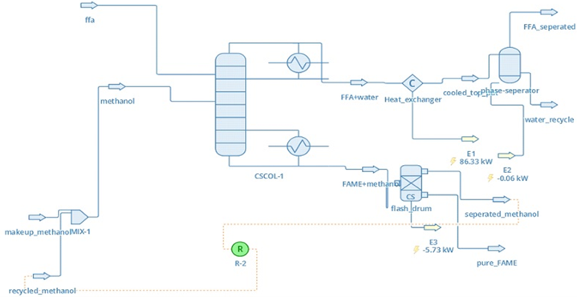
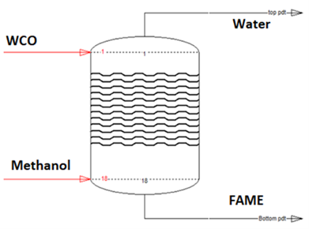
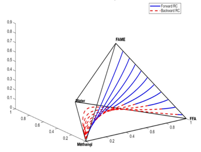
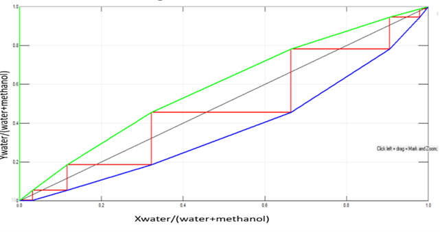

# Biodiesel_production
Process design and simulation of an 18-stage Reactive Absorption Column (RAC) for converting waste cooking oil (WCO) into biodiesel (FAME), using a bifunctional Tungstated Zirconia/Calcium Oxide-Alumina (WZ/CaO-A) catalyst.

## Motivation:
Conventional CSTR and reactive distillation (RD) routes for biodiesel production are limited by mass transfer, high methanol-to-oil ratios (6:1–9:1), and reboiler/condenser energy costs. This project applies process intensification via reactive absorption — using vapor-phase methanol to strip water in-situ — to overcome these limitations.

## Methods:
- Simulated in DWSim/ChemSep using the NRTL activity coefficient model, with rate-based (non-equilibrium) staged modeling (this repo)
- Cross-validated independently via a MATLAB theoretical framework (kinetics + reactive residue curve mapping) developed in collaboration with my faculty supervisor; MATLAB code not included here as it builds on the supervisor's proprietary framework
- Parametric study over feed temperature, column pressure, methanol:oil ratio, and stage count
- Reactive residue curve mapping to confirm azeotrope-free operation
- McCabe-Thiele analysis for the water-methanol subsystem

## Key results:
- more than 99% single-pass conversion at an 18-stage configuration
- Reduced methanol:oil ratio of 1.1:1 (vs. 6:1–9:1 for conventional CSTR)
- 20% lower fixed capital cost and ~30% lower utility cost vs. reactive distillation
- Confirmed azeotrope-free reactive equilibrium via RRCM and McCabe-Thiele cross-checks

## Figures

